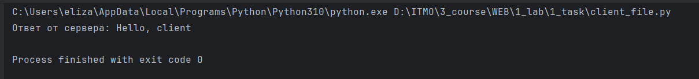
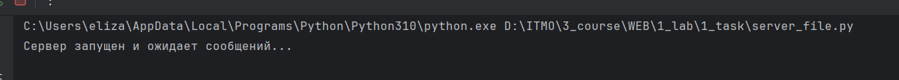

# Задание 1

Реализовать клиентскую и серверную часть приложения. Клиент отправляет серверу сообщение «Hello, server», и оно должно отобразиться на стороне сервера. В ответ сервер отправляет клиенту сообщение «Hello, client», которое должно отобразиться у клиента.

Требования:

Обязательно использовать библиотеку socket.
Реализовать с помощью протокола UDP.

**код из файла client.py:**
```python
import socket

client_socket = socket.socket(socket.AF_INET, socket.SOCK_DGRAM)

server_address = ('localhost', 8080)

message = "Hello, server"

try:
    client_socket.sendto(message.encode(), server_address)
    data, server = client_socket.recvfrom(1024)
    print(f"Ответ от сервера: {data.decode()}")

finally:
    client_socket.close()
```

**код из файла server.py:**
```python
import socket

server_socket = socket.socket(socket.AF_INET, socket.SOCK_DGRAM)
server_address = ('localhost', 8080)

server_socket.bind(server_address)

print("Сервер запущен и ожидает сообщений...")

while True:
    data, client_address = server_socket.recvfrom(1024)

    print(f"Получено сообщение от клиента {client_address}: {data.decode()}")

    response = "Hello, client"
    server_socket.sendto(response.encode(), client_address)

```


