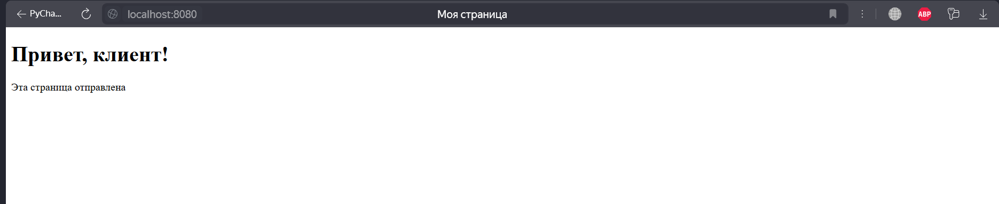

# Задание 3

Реализовать серверную часть приложения. Клиент подключается к серверу, и в ответ получает HTTP-сообщение, содержащее HTML-страницу, которая сервер подгружает из файла index.html.

Требования:

Обязательно использовать библиотеку socket.

**код из файла server.py:**
```python
import socket

HOST = "127.0.0.1"  # Локальный хост
PORT = 8080         # Порт сервера

# Создаем TCP-серверный сокет
server_socket = socket.socket(socket.AF_INET, socket.SOCK_STREAM)
server_socket.bind((HOST, PORT))
server_socket.listen(5)  # Ожидаем до 5 подключений

print(f"Сервер запущен на {HOST}:{PORT}...")

while True:
    client_socket, client_address = server_socket.accept()
    print(f"Подключился клиент: {client_address}")

    # Получаем запрос от клиента
    request = client_socket.recv(1024).decode()
    print(f"Запрос от клиента:\n{request}")

    # Читаем содержимое HTML-файла
    try:
        with open("index.html", "r", encoding="utf-8") as file:
            html_content = file.read()
    except FileNotFoundError:
        html_content = "<h1>Ошибка 404: Файл index.html не найден</h1>"

    # Формируем HTTP-ответ
    response = (
        "HTTP/1.1 200 OK\r\n"
        "Content-Type: text/html; charset=utf-8\r\n"
        f"Content-Length: {len(html_content)}\r\n"
        "\r\n"
        f"{html_content}"
    )

    # Отправляем ответ клиенту
    client_socket.sendall(response.encode())

    # Закрываем соединение
    client_socket.close()

```
Код из файла index.html
```html
<<!DOCTYPE html>
<html lang="ru">
<head>
    <meta charset="UTF-8">
    <title>Моя страница</title>
</head>
<body>
    <h1>Привет, клиент!</h1>
    <p>Эта страница отправлена сервером через socket.</p>
</body>
</html>

```

После запуска сервера переходим на http://localhost:8080

**Работа сервера на localhost при запуске кода на скриншоте**


