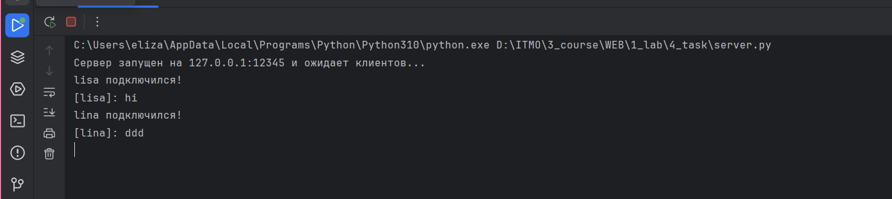

# Задание 4

Реализовать двухпользовательский или многопользовательский чат. Для максимального количества баллов реализуйте многопользовательский чат.

Требования:

Обязательно использовать библиотеку socket.

Для многопользовательского чата необходимо использовать библиотеку threading.


**код из файла client.py:**
```python
import socket
import threading

HOST = "127.0.0.1"
PORT = 12345

client_socket = socket.socket(socket.AF_INET, socket.SOCK_STREAM)
client_socket.connect((HOST, PORT))

username = input("Введите ваше имя: ")
client_socket.send(username.encode())


def receive_messages():
    while True:
        try:
            message = client_socket.recv(1024).decode()
            if not message:
                break
            print("\n" + message)
        except:
            print("⚠️ Соединение с сервером потеряно.")
            break


thread = threading.Thread(target=receive_messages, daemon=True)
thread.start()

print("🔵 Вы подключились к чату! Введите сообщение и нажмите Enter (или /exit для выхода).")

while True:
    try:
        message = input()
        if message.lower() == "/exit":
            client_socket.send(message.encode())
            print("🔴 Вы вышли из чата.")
            client_socket.close()
            break
        client_socket.send(message.encode())
    except KeyboardInterrupt:
        print("\n🔴 Вы вышли из чата.")
        client_socket.send("/exit".encode())
        client_socket.close()
        break

```

**код из файла server.py:**


```python
import socket
import threading

HOST = "127.0.0.1"
PORT = 12345

server_socket = socket.socket(socket.AF_INET, socket.SOCK_STREAM)
server_socket.bind((HOST, PORT))
server_socket.listen()

clients = {}  


def handle_client(client_socket):
    try:

        username = client_socket.recv(1024).decode().strip()
        clients[client_socket] = username
        print(f"{username} подключился!")

        broadcast(f"🎉 {username} присоединился к чату!", client_socket)

        while True:
            message = client_socket.recv(1024).decode().strip()
            if message.lower() == "/exit":
                break  

            print(f"[{username}]: {message}")
            broadcast(f"[{username}]: {message}", client_socket)

    except ConnectionResetError:
        pass  
    finally:
        username = clients.pop(client_socket, "Неизвестный пользователь")
        print(f"{username} отключился.")
        broadcast(f"❌ {username} вышел из чата.", client_socket)
        client_socket.close()


def broadcast(message, sender_socket=None):
    for client in list(clients.keys()):  
        if client != sender_socket:
            try:
                client.send(message.encode())
            except:
                clients.pop(client, None)
                client.close()


print(f"Сервер запущен на {HOST}:{PORT} и ожидает клиентов...")

while True:
    client_socket, _ = server_socket.accept()
    thread = threading.Thread(target=handle_client, args=(client_socket,))
    thread.start()

```
**Работа первого клиента при запуске кода на скриншоте**



